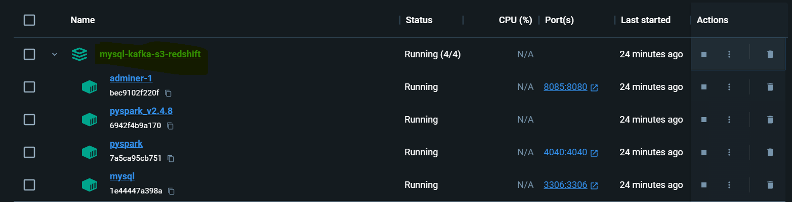
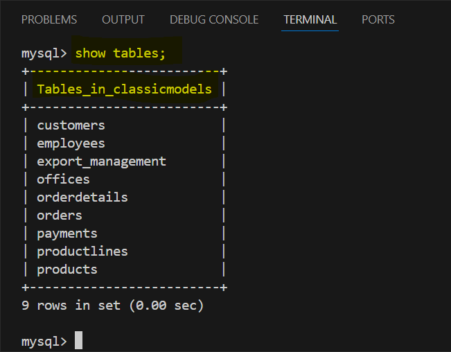
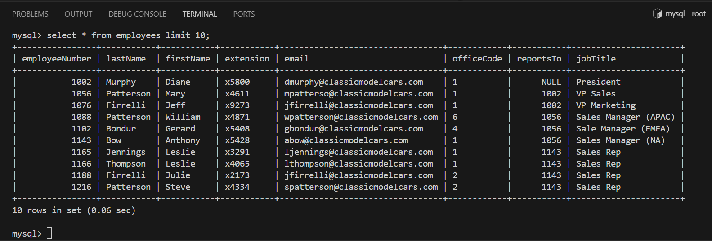
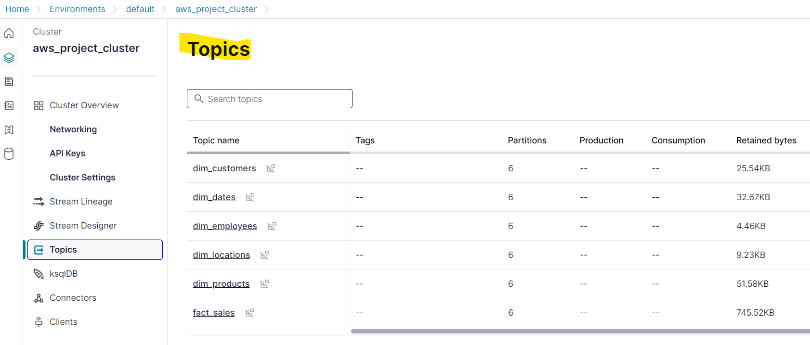
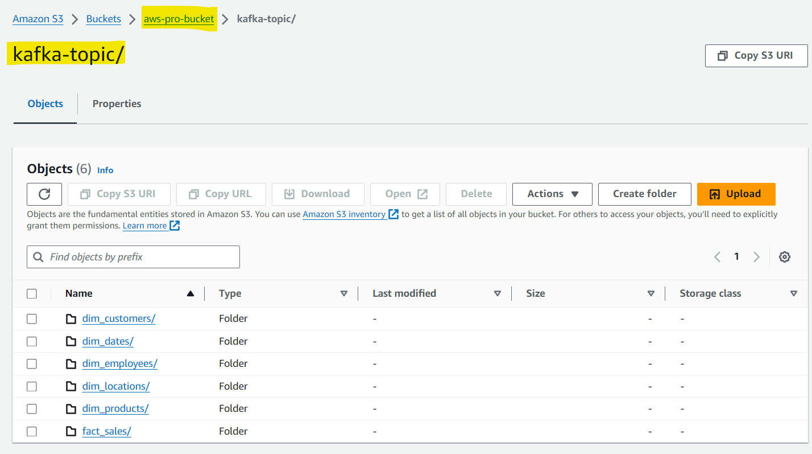
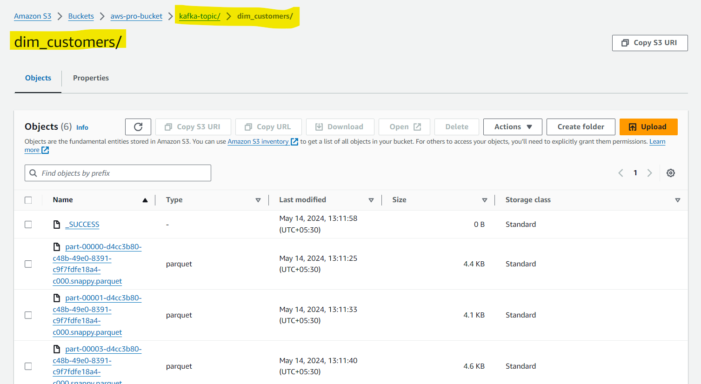
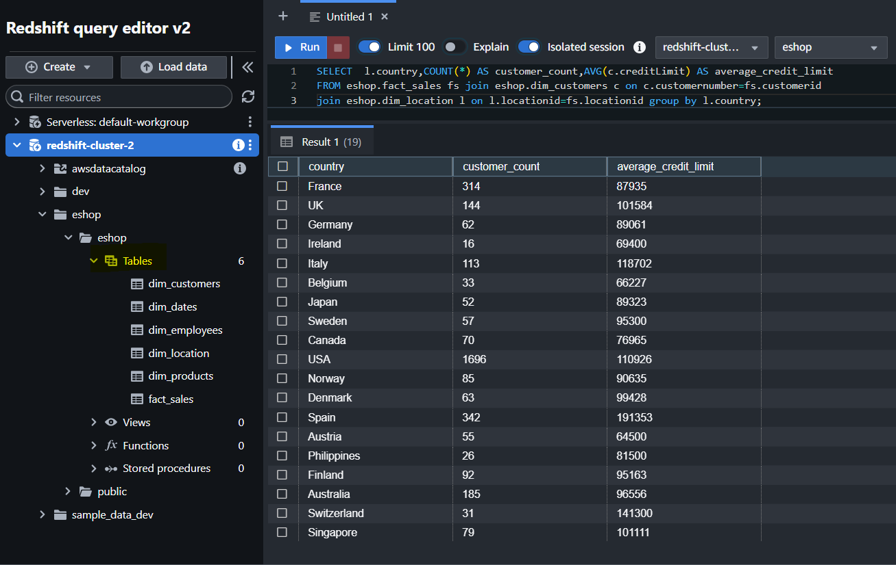
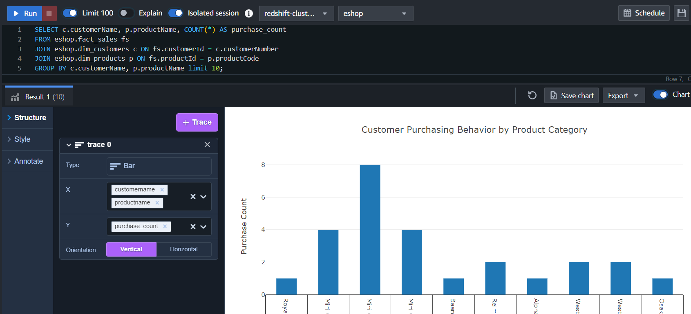
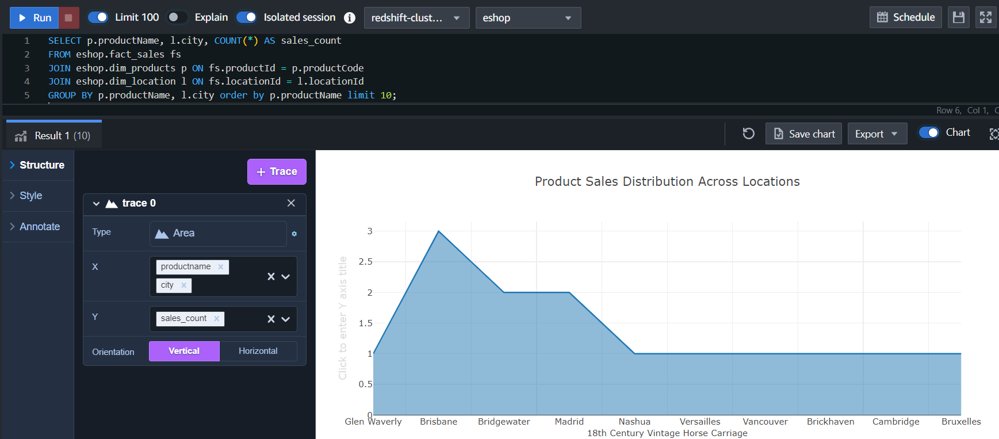
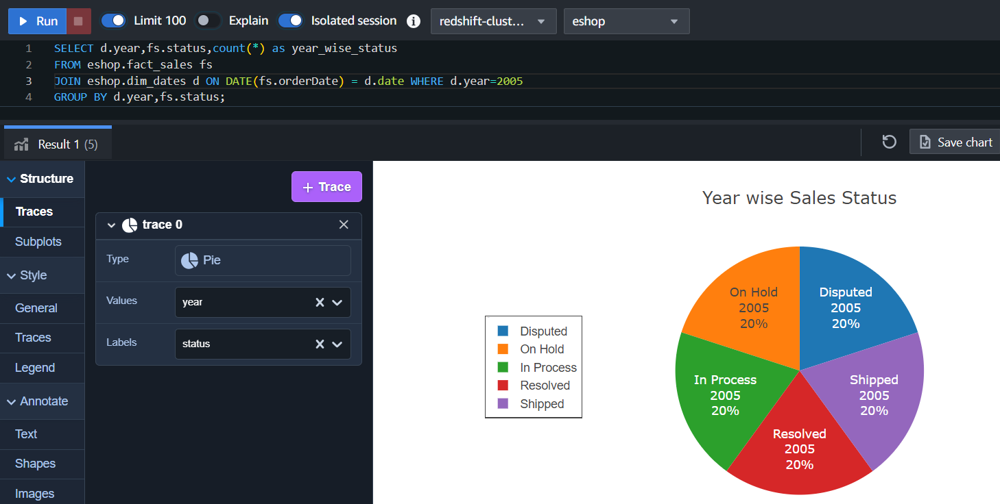

**Summary:**

This project revolves around constructing a containerized data capture pipeline, orchestrating the seamless transfer of information from a MySQL database to Amazon Redshift for visualization purposes. Docker containers are employed for their ability to ensure consistency and portability across diverse environments. A Change Data Capture (CDC) pipeline is used to tracking changes made to data within a database system over time. The pipeline utilizes Kafka as a pivotal intermediary for real-time data streaming, facilitating ingestion of MySQL data into Redshift. Amazon S3 serving as an intermediate repository for raw data prior to any transformation. Redshift plays a crucial role in enabling efficient processing of analytics, empowering users to extract actionable insights from the data.

Export data from mysql-database to REDSHIFT using kafka

Problem Statement:
We need to build an ETL pipeline to dump mysql data base record to redshift using kafka

RedShift Data warehouse (Transfored data in fact and dimentional tables)

Approach:

1.Read data from mysql and  send to kafka topic and from kafka topic we will dump to s3 bucket

2.Read data from s3 bucket and dump in REDSHIFT

Solution:

1. Docker Container

2. Created SQL tables using database-dump/mysqlsampledatabase.sql file

3. Sample MySQL employee table data

4. Sample Kafka Topics

5. Sample data from customers kafka topic

6. S3 Objects

7. Sample s3 data from customers object

8. Sample Redshift tables and data

9. Data Visualization in Bar Chart format

10. Data Visualization in Area Chart format

11. Data Visualization in Pie Chart format

12. Data Visualization in Line Chart format

